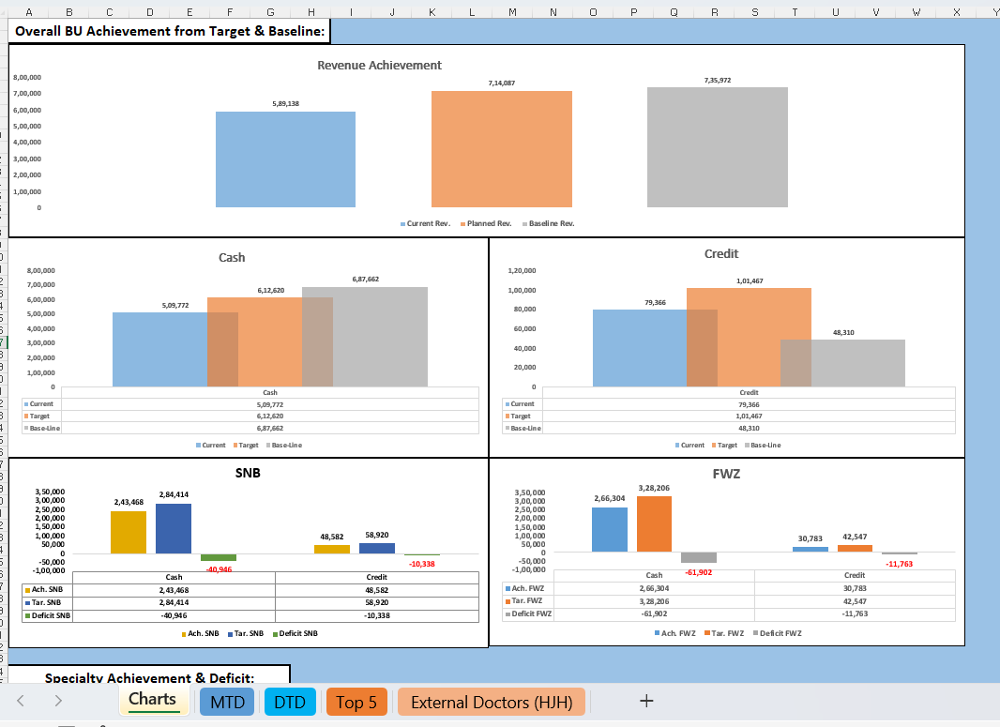

# 🏥 Healthcare Productivity & Performance MIS Dashboard

### 📊 Excel-Based Healthcare MIS Reporting & Productivity Analytics Project

Monitor doctor productivity, operational KPIs, and healthcare performance through an interactive MIS dashboard.

---

# 📌 Project Overview

The **Healthcare Productivity & Performance MIS Dashboard** is an Excel-based reporting and analytics project designed to monitor doctor productivity, operational efficiency, and KPI performance within a healthcare environment.

This dashboard helps management track:
- 👨‍⚕️ Doctor Productivity
- 📈 Performance Metrics
- 🎯 KPI Achievement
- 🏥 Operational Efficiency
- 📊 Reporting & Trend Analysis

The project transforms raw healthcare operational data into actionable business insights for performance monitoring and decision-making.

---

# ✨ Key Features

✅ Interactive MIS Dashboard  
✅ KPI-Based Productivity Reporting  
✅ Doctor Performance Analysis  
✅ Operational Efficiency Tracking  
✅ Trend & Performance Monitoring  
✅ Pivot Table Reporting  
✅ Data Visualization & Reporting  

---

# 🛠️ Tools & Technologies Used

| Tool | Purpose |
|------|---------|
| Microsoft Excel | Data Analysis & Dashboarding |
| Pivot Tables | MIS Reporting |
| Charts & Graphs | Data Visualization |
| Excel Formulas | KPI Calculations |

---

# 📊 Business KPIs Tracked

- Doctor Productivity
- Performance Metrics
- Operational KPIs
- Productivity Trends
- Department-wise Analysis
- Reporting Accuracy

---

# 📈 Business Insights Generated

🔹 Identified productivity trends across healthcare operations  
🔹 Evaluated doctor performance using KPI reports  
🔹 Generated operational reports for management review  
🔹 Improved visibility of healthcare performance metrics  

---

# 📷 Dashboard Preview

